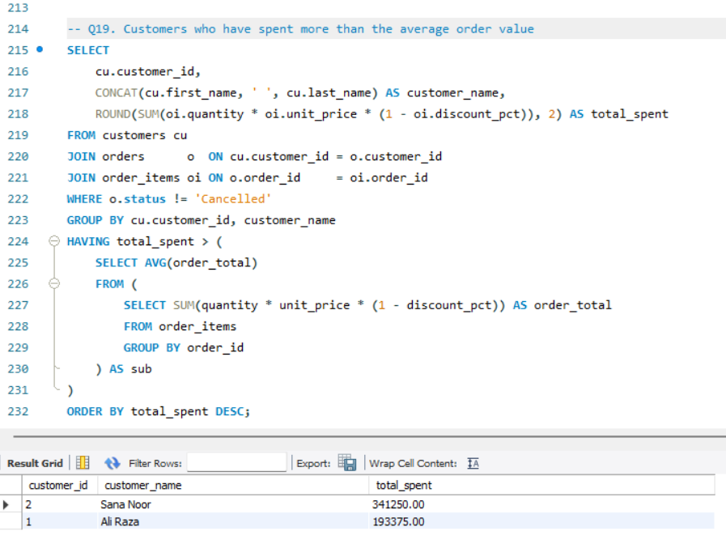

# 🛒 E-Commerce & Sales Analytics — SQL Portfolio Project

A complete, end-to-end SQL portfolio project built on a realistic Pakistani e-commerce dataset. This project covers everything from basic SELECT queries all the way up to recursive CTEs, window functions, stored procedures, and performance indexing.

---

## 📑 Table of Contents

- [Project Overview](#project-overview)
- [Database Schema](#database-schema)
- [Sections Covered](#sections-covered)
- [Query Showcase & Screenshots](#query-showcase--screenshots)
- [Files in this Repository](#files-in-this-repository)
- [How to Run](#how-to-run)

---

## Project Overview

| Detail | Info |
|---|---|
| **Database** | MySQL |
| **Dataset** | Custom Pakistani e-commerce data (customers, orders, products, employees) |
| **Total Queries** | 35+ queries across 13 sections |
| **Concepts Covered** | Basic SELECT → Joins → Aggregation → Subqueries → Views → Window Functions → CTEs → Stored Procedures → Indexes → DML |

---

## Database Schema

The database (`ecommerce_data`) contains 6 tables:

```
sales_regions   ──< employees ──< orders ──< order_items >── products >── categories
                                     │
                                  customers
```

| Table | Description |
|---|---|
| `customers` | Customer profiles with city, segment (Retail / Wholesale / VIP), and signup date |
| `employees` | Staff with job titles, salaries, manager hierarchy, and region assignment |
| `products` | Product catalogue with pricing, stock, and category |
| `categories` | Product category lookup |
| `orders` | Order header — links customer, employee, dates, and status |
| `order_items` | Line items — quantity, price at purchase time, and discount |

---

## Sections Covered

| # | Section | Key Concepts |
|---|---|---|
| 1 | Basic Queries | `SELECT`, `WHERE`, `ORDER BY`, `LIMIT`, `IN`, `BETWEEN`, `IS NULL` |
| 2 | Aggregation & Grouping | `GROUP BY`, `HAVING`, `COUNT`, `SUM`, `AVG`, `MIN`, `MAX` |
| 3 | Joins | `INNER JOIN`, `LEFT JOIN`, self-join, multi-table joins |
| 4 | Subqueries & CASE WHEN | Correlated subqueries, `IN` / `NOT IN`, conditional logic |
| 5 | Views | `CREATE VIEW`, reusable summaries |
| 6 | Window Functions | `ROW_NUMBER`, `RANK`, `DENSE_RANK`, `NTILE`, `LAG`, `LEAD`, `FIRST_VALUE`, running totals, rolling averages |
| 7 | CTEs | Single CTE, chained CTEs, recursive CTE (org chart) |
| 8 | Stored Procedures & Functions | `IN` / `OUT` parameters, scalar function, `DELIMITER` |
| 9 | Indexes | Single-column, composite, `EXPLAIN` plan |
| 10 | DML | `UPDATE` with `JOIN`, `DELETE` with date filter |
| 11 | Capstone Query | CTEs + Window Functions + CASE WHEN combined |

---

## Query Showcase & Screenshots

### 📌 Basic Queries

---

#### Q2 — All Orders Delivered in 2023
Filters orders by `status = 'Delivered'` and a date range.

```sql
SELECT order_id, customer_id, order_date, shipped_date, status
FROM orders
WHERE status = 'Delivered'
  AND order_date BETWEEN '2023-01-01' AND '2023-12-31'
ORDER BY order_date;
```


---

#### Q3 — Products Priced Between 5,000 and 20,000
Uses `BETWEEN` to filter by price range.

```sql
SELECT product_name, unit_price, stock_qty
FROM products
WHERE unit_price BETWEEN 5000 AND 20000
ORDER BY unit_price ASC;
```


---

#### Q5 — Orders That Haven't Been Shipped Yet
Finds rows where `shipped_date IS NULL`.

```sql
SELECT order_id, customer_id, order_date, status
FROM orders
WHERE shipped_date IS NULL;
```


---

#### Q6 — Calculate Revenue for Each Line Item
Applies the discount formula: `quantity × unit_price × (1 − discount_pct)`.

```sql
SELECT order_id, product_id, quantity, unit_price, discount_pct,
       ROUND(quantity * unit_price * (1 - discount_pct), 2) AS line_revenue
FROM order_items
ORDER BY order_id;
```


---

#### Q7 — Products Containing "Set" in Their Name
Demonstrates the `LIKE` operator with a wildcard.

```sql
SELECT product_name, unit_price, stock_qty
FROM products
WHERE product_name LIKE '%Set%';
```


---

### 📌 Aggregation & Grouping

---

#### Q9 — How Many Customers Are in Each Segment?

```sql
SELECT segment, COUNT(*) AS total_customers
FROM customers
GROUP BY segment
ORDER BY total_customers DESC;
```


---

#### Q10 — Total Revenue Generated by Each Order

```sql
SELECT oi.order_id,
       ROUND(SUM(oi.quantity * oi.unit_price * (1 - oi.discount_pct)), 2) AS order_revenue
FROM order_items oi
GROUP BY oi.order_id
ORDER BY order_revenue DESC;
```


---

### 📌 Joins

---

#### Q14 — Every Order With Customer Name and Handling Employee
Uses two `INNER JOIN`s across three tables.

```sql
SELECT o.order_id,
       CONCAT(c.first_name, ' ', c.last_name) AS customer_name, c.city,
       CONCAT(e.first_name, ' ', e.last_name) AS handled_by,
       o.order_date, o.status
FROM orders o
INNER JOIN customers c ON o.customer_id = c.customer_id
INNER JOIN employees e ON o.employee_id = e.employee_id
ORDER BY o.order_date;
```


---

#### Q15 — All Customers and Their Order Count
`LEFT JOIN` ensures customers with zero orders still appear.

```sql
SELECT c.customer_id,
       CONCAT(c.first_name, ' ', c.last_name) AS customer_name,
       c.segment, COUNT(o.order_id) AS total_orders
FROM customers c
LEFT JOIN orders o ON c.customer_id = o.customer_id
GROUP BY c.customer_id, customer_name, c.segment
ORDER BY total_orders DESC;
```


---

#### Q18 — Full Order Breakdown
Joins five tables: orders, customers, order_items, products, and categories.

```sql
SELECT o.order_id,
       CONCAT(cu.first_name, ' ', cu.last_name) AS customer,
       p.product_name, cat.category_name,
       oi.quantity, oi.unit_price, oi.discount_pct,
       ROUND(oi.quantity * oi.unit_price * (1 - oi.discount_pct), 2) AS line_total
FROM orders o
JOIN customers   cu  ON o.customer_id = cu.customer_id
JOIN order_items oi  ON o.order_id    = oi.order_id
JOIN products    p   ON oi.product_id = p.product_id
JOIN categories  cat ON p.category_id = cat.category_id
ORDER BY o.order_id;
```


---

### 📌 Subqueries & CASE WHEN

---

#### Q19 — Customers Who Spent More Than the Average Order Value
Nested subquery computes the average; `HAVING` filters the outer query.

```sql
SELECT cu.customer_id,
       CONCAT(cu.first_name, ' ', cu.last_name) AS customer_name,
       ROUND(SUM(oi.quantity * oi.unit_price * (1 - oi.discount_pct)), 2) AS total_spent
FROM customers cu
JOIN orders      o  ON cu.customer_id = o.customer_id
JOIN order_items oi ON o.order_id     = oi.order_id
WHERE o.status != 'Cancelled'
GROUP BY cu.customer_id, customer_name
HAVING total_spent > (
    SELECT AVG(order_total)
    FROM (
        SELECT SUM(quantity * unit_price * (1 - discount_pct)) AS order_total
        FROM order_items
        GROUP BY order_id
    ) AS sub
)
ORDER BY total_spent DESC;
```



---

## Files in this Repository

```
SQL_Portfolio/
├── schema.sql       # CREATE DATABASE, all table definitions, foreign keys
├── data.sql         # INSERT statements — sample data for all tables
├── analysis.sql     # All 35+ queries across 13 sections
├── README.md        # This file
└── screenshots/     # Output screenshots for each key query
```

---

## How to Run

1. **Create the schema**
   ```bash
   mysql -u root -p < schema.sql
   ```

2. **Load the sample data**
   ```bash
   mysql -u root -p < data.sql
   ```

3. **Run the analysis queries**
   ```bash
   mysql -u root -p ecommerce_data < analysis.sql
   ```
   Or open `analysis.sql` in MySQL Workbench and run sections individually.

> **Requirement:** MySQL 8.0+ (recursive CTEs and window functions require version 8+).

---

## Skills Demonstrated

- Relational database design with proper foreign keys and constraints
- Multi-table `JOIN`s including self-joins for hierarchical data
- Aggregation with `GROUP BY` / `HAVING`
- Correlated subqueries and `IN` / `NOT IN` filters
- Reusable `VIEW`s for complex queries
- Window functions: ranking, running totals, rolling averages, LAG/LEAD
- Recursive CTEs for org-chart traversal
- Stored procedures with `IN` / `OUT` parameters and a scalar function
- Performance optimization with single-column and composite indexes
- DML operations: bulk `UPDATE` with joins and date-filtered `DELETE`
